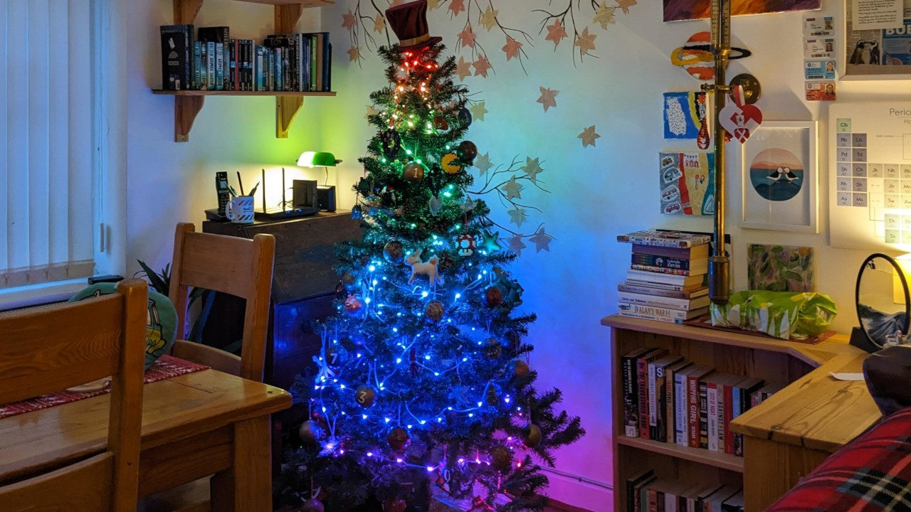

=============
Blinken' Xmas
=============

Are you sitting comfortably? Then I'll begin …

A long time ago, in a land far, far away called "Manchester", there lived the
Jones family. At this festive time of year they would put up their ceremonial
totem, the "Asda 6ft Pre-Lit Green Christmas Tree". But 'twas the year of the
Great Plague, and even the electrickery faired poorly, and lo! The Asda 6ft
Pre-Lit Green Christmas Tree had become The Asda 6ft Not-Even-Slightly-Lit
Green Christmas Tree, not Pre-Lit, nor Lit, but possibly Post-Lit.

And all were most vexed.

In the great drawer of unstatic bags in the loft, there lived the `neopixies`_.
And they cried out, "use us, for we shall bring light and all manner of
blinkeness to your tree!" So the one called "Dave" gathered together 150 of the
neopixies, and waved his magic Pico at them [#wrong1]_, and the tree glowed
brightly with their warmth.

And it was Good.

But the neopixies were not content with glowing warm white all the time, and
whispered to Dave that they could make all the colours of the rainbow, if only
he would wave his magic Pico a bit more [#wrong2]_. And so Dave set to work,
and after much toil (and no small amount of "why is the tree dark? Can't you
just make it one colour, again? That was fine!"), the tree was lit once more,
but this time with all the colours of the rainbow! But the design was rough;
mere anarchy loosed upon the innocent eyeballs of the viewer [#sorry1]_. And
all who saw it did whisper, "it's very colourful, but in a unicorn vomit sort
of a way".

And lo! A `message from the Prophet Parker`_ did appear.

And it was good. If a bit thin on detail. I mean, where's the calibration trig?
But Dave was unperturbed and vowed that he would wrangle the neopixies with his
mathemagic and bring order to the Asda 6ft Unicorn-Vomit Christmas Tree. But
his `trigo-gnometry`_ had gathered dust for too many years, and his mathemagic
was not sufficient to the cause, so in the end he relented, and all had to be
content with a simple twinkling of the warm white lights that year.

The season passed, the Asda 6ft Post-Lit Green Christmas Tree was packed away,
and the neopixies returned to their drawer, awaiting their chance to shine like
crazy tetrahedral carbon crystals once more [#sorry2]_.

Time moved on, and in the waxing light of spring, the project appeared
forgotten. The neopixies wept as the Pico was waved at other things, like
to-martoes in the back garden, or o-ink paper, but never at them. But in the
waning light of autumn, as the nights closed in, they suddenly found themselves
freed once more. To their surprise, Dave bound them to a new creature known as
a "`picow`_". And the picow listened to a `mosquitto`_ that listened to a pie
that listened to a web that listened to strange beings called "yousers".

And Dave said "this is all getting a bit complex, and I still haven't figured
out this trigo-gnometry stuff".

So he sought `help from the wizards`_ who exchange stacks. And lo! The answer
arrived faster than a speeding pizza. And Dave was sore annoyed at himself that
the answer was so simple. But no matter, for now he could wield the
mathemagical power to control and conduct the mischievous neopixies in a
glorious symphony of light!

And so it came to pass that Dave procured
`even <https://shop.pimoroni.com/products/5m-flexible-rgb-led-wire-50-rgb-leds-aka-neopixel-ws2812-sk6812?variant=40384556171347>`_
`more <https://thepihut.com/products/adafruit-soft-flexible-wire-neopixel-strand-50-neopixels>`_
neopixies, swelling their orchestra until it was full 250 strong. And though
Dave was not disgruntled, he was far from gruntled [#sorry3]_ that this was but
half the count of `The Prophet Parker's most learned of trees`_. But no one
else was listening. For the yousers were too busy plucking the fibres of the
web to talk to the pie to talk to the mosquitto to talk to the picow to conduct
the neopixies into making the Asda 6ft Blinken Tree shine and shimmy and
glitter and blast Pride flags at the eyeballs of innocent bystanders.

In time, others versed in the ways of code saw the tree and said "have you
open-sourced it yet?", and Dave looked at his private suppository and said "but
there's no docs … or tests … or even type-hints?" And the others said "no one
cares, Dave, it's a Christmas tree, not a nuclear reactor".

And lo! Dave did flip the private switch and there was light! In all the
colours of unicorn vomit …

          tasteful rainbow over the height of the tree.

----

.. _neopixies: https://en.wikipedia.org/wiki/Adafruit_Industries#NeoPixel
.. _message from the Prophet Parker: https://www.youtube.com/watch?v=TvlpIojusBE
.. _trigo-gnometry: https://en.wikipedia.org/wiki/List_of_trigonometric_identities
.. _help from the wizards: https://math.stackexchange.com/questions/4816183/radius-of-circle-given-horizontal-distances-of-two-points-and-angle-between-them/4816273
.. _The Prophet Parker's most learned of trees: https://www.youtube.com/watch?v=WuMRJf6B5Q4
.. _picow: https://www.raspberrypi.com/news/raspberry-pi-pico-w-what-did-you-think/
.. _mosquitto: https://mosquitto.org/

.. [#wrong1] That just sounds wrong -- Ed

.. [#wrong2] That's not getting any better, you know -- Ed

.. [#sorry1] With apologies to W.B. Yeats

.. [#sorry2] With apologies to Pink Floyd

.. [#sorry3] With no apologies at all to P.G. Wodehouse; damn you, that line's
   too good not to steal!
