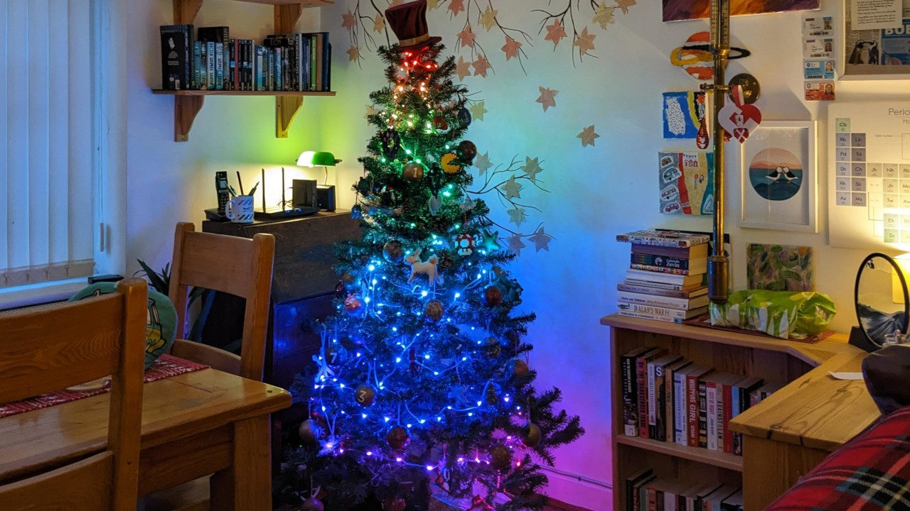

Welcome to Blinken' Xmas! A project to display a tasteful assortment of
positively festive animations across strings of neopixels adorning your
Christmas tree. Or a project to blast screaming rainbows into the eyeballs of
your nearest and dearest. I take no responsibility for your choices.

          tasteful rainbow over the height of the tree.

The :doc:`tutorial` is probably the best place to start as it'll walk you
through all the hardware configuration, and software installation. If you want
to hack on the project, it's pretty easy to add animations; see the
:doc:`development` chapter on getting started.

.. warning::

    The documentation is still very incomplete...

Contents
========

.. toctree::
    :maxdepth: 1

    install
    tutorial
    bxflash
    bxweb
    bxcli
    api
    development
    changelog
    license

Indices and tables
==================

* :ref:`modindex`
* :ref:`genindex`
