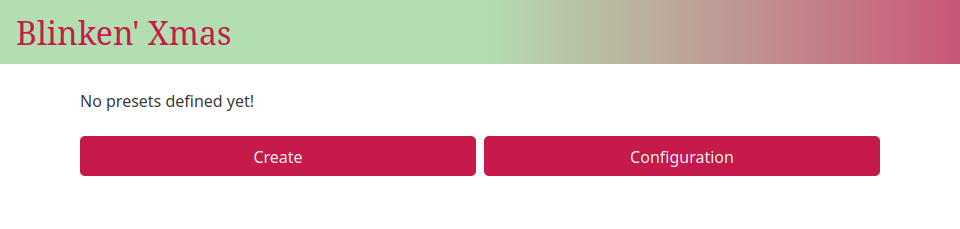
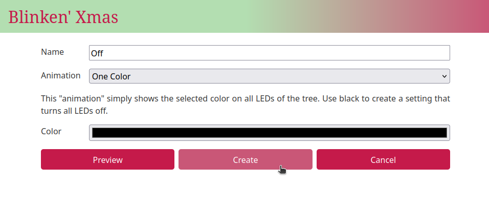
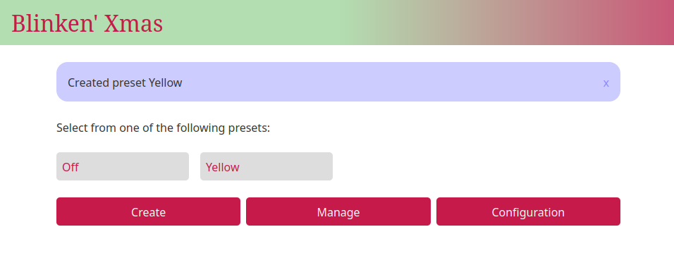

==========
First Boot
==========

At this point, your hardware and software installation is complete. It's time
to test the basic (uncalibrated) operation to make sure everything is working.

#. Your Pi should already be booted, and you should be able to view the
   Blinken' Xmas web page at "blinkenxmas.local" on your network

#. Plug the Pico's housing into the wall socket

#. Watch the status LED and cross your fingers!

If everything goes correctly, you should see the Pico's status :term:`LED`
start to flash periodically, before eventually staying on. The flashes of the
status LED indicate the following:

2 flashes
    Indicates the Pico has booted Micropython and is trying to connect to the
    wifi AP

3 flashes
    The Pico has connected to the configured wifi AP and is trying to connect
    to the MQTT broker

solid
    The Pico has connected to the broker and is awaiting animations to display

5 flashes
    The Pico's script has crashed and it is not configured to reset
    automatically (by default, it will simply restart in this event)

Troubleshooting
===============

If the LED eventually turns solid, and you can see the web interface, skip this
section. Otherwise, check the following:

no flashes
    * Check the mains wiring to the power supply

    * Check the 5V wiring from the supply to your Pico

    * Check you've connected the status LED to the correct GPIO pin

    * Check that the LED is connected the right way around

2 flashes
    * Check the Pico's wifi configuration is correct

3 flashes
    * Check the Pico's MQTT configuration is correct (especially that the
      ``host`` setting is not ``localhost``, which will work on the Pi, but no
      the Pico)

5 flashes
    * Check the Pico was flashed correctly

    * Re-flash the base Pimoroni firmware (possibly downgrading to one of the
      versions mentioned specifically, earlier)

no web interface
    Plug the Pi into a monitor and keyboard. Make sure it has booted, and that
    the ``nginx`` and ``blinkenxmas-server`` services are running:

    .. code-block:: console

        ubuntu@tree:~$ systemctl status nginx.service
        ● nginx.service - A high performance web server and a reverse proxy server
             Loaded: loaded (/lib/systemd/system/nginx.service; enabled; vendor preset: enabled)
             Active: active (running) since Thu 2024-12-12 20:42:41 UTC; 2 days ago
               Docs: man:nginx(8)
           Main PID: 12846 (nginx)
              Tasks: 5 (limit: 1848)
             Memory: 4.0M
                CPU: 889ms
             CGroup: /system.slice/nginx.service
                     ├─12846 "nginx: master process /usr/sbin/nginx -g daemon on; master_process on;"
                     ├─12847 "nginx: worker process" "" "" "" "" "" "" "" "" "" "" "" "" "" "" "" "" "" "" "" "" "" "" "" "" "" "" ""
                     ├─12848 "nginx: worker process" "" "" "" "" "" "" "" "" "" "" "" "" "" "" "" "" "" "" "" "" "" "" "" "" "" "" ""
                     ├─12849 "nginx: worker process" "" "" "" "" "" "" "" "" "" "" "" "" "" "" "" "" "" "" "" "" "" "" "" "" "" "" ""
                     └─12850 "nginx: worker process" "" "" "" "" "" "" "" "" "" "" "" "" "" "" "" "" "" "" "" "" "" "" "" "" "" "" ""

        Dec 12 20:42:41 tree systemd[1]: Starting A high performance web server and a reverse proxy server...
        Dec 12 20:42:41 tree systemd[1]: Started A high performance web server and a reverse proxy server.
        ubuntu@tree:~$ systemctl status blinkenxmas-server.service 
        ● blinkenxmas-server.service - Blinkenxmas web service
             Loaded: loaded (/lib/systemd/system/blinkenxmas-server.service; enabled; vendor preset: enabled)
             Active: active (running) since Sat 2024-12-14 06:35:18 UTC; 1 day 11h ago
           Main PID: 28982 (bxweb)
              Tasks: 10 (limit: 1848)
             Memory: 43.4M
                CPU: 2min 50.210s
             CGroup: /system.slice/blinkenxmas-server.service
                     └─28982 /usr/bin/python3 /usr/bin/bxweb --production

        Dec 14 15:55:26 tree bxweb[28982]: 127.0.0.1 - - [14/Dec/2024 15:55:26] "GET / HTTP/1.0" 301 -
        Dec 14 15:55:26 tree bxweb[28982]: 127.0.0.1 - - [14/Dec/2024 15:55:26] "GET /index.html HTTP/1.0" 200 -

Switch on time!
===============

Once everything is running successfully, visit the web interface. You should
see a notice that no presets have been defined yet.

          the bottom labeled "Create" and "Configuration"

Let's correct that by
defining some very basic presets which will work even without calibration.

#. Select "Create"

#. Set the name to "Off"

#. Pick "One Color" from the list of animations

#. Pick black in the color picker that appears

#. Select "Create"

          of name, animation, and color options.

You should find yourself back on the home screen with a message indicating the
"Off" preset was created. Now that we have the most boring possible preset,
let's check the LEDs are working. Create a simple yellow preset:

#. Select "Create"

#. Set the name to "Yellow"

#. Pick "One Color" from the list of animations

#. Pick a relatively dark yellow from the color picker

#. Select "Preview" and watch the LEDs on the tree light up yellow

#. Select "Create"

Back at the main page you can toggle between "Yellow" and "Off" by selecting
the presets. Time for something more colorful:

#. Select "Create"

#. Set the name to "Rainbows"

#. Pick "Scrolling Rainbow (by index)" from the list of animations

#. Set "Duration" to the middle of the range

#. Select "Create"

Back at the main page, select "Rainbows" from the list of presets. Your treat
should (after a short delay) light up with all the colors of the rainbow which
should gradually shift through the spectrum on all the LEDs. While very
colorful, it should also be obvious that the rainbow isn't particularly
coordinated.

This is because we are display a single rainbow along all our neopixels.
However, our LEDs are split into two uneven groups of 50 LEDs and 100 LEDs. If
we want a rainbow that coordinates its display across the height of the tree,
we're going to need to calibrate the positions of our LEDs...
